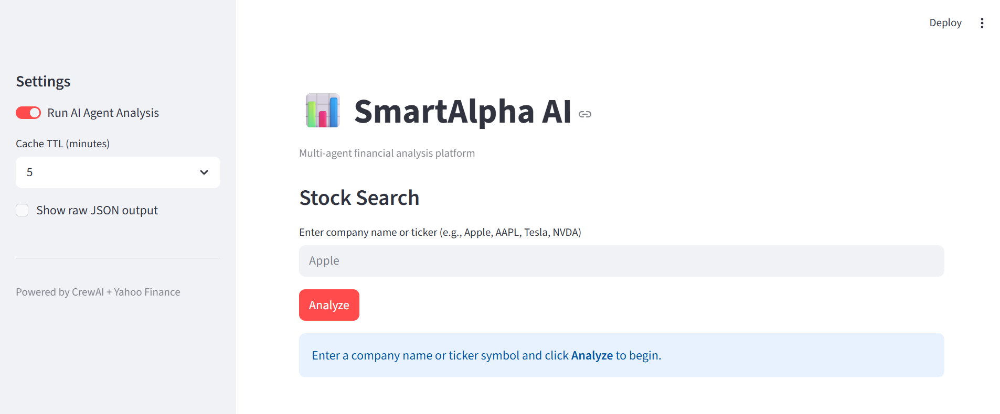
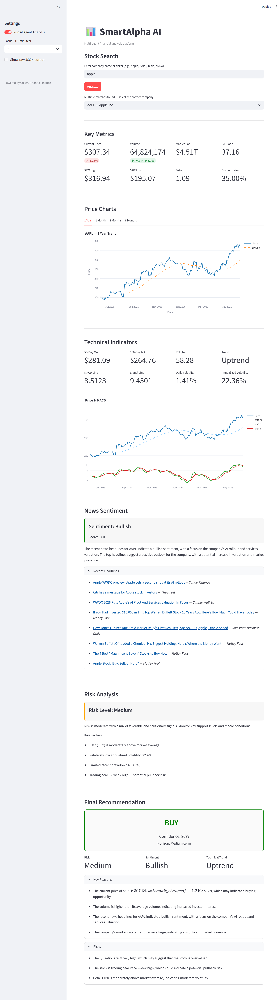

# SmartAlpha AI

SmartAlpha AI is a multi-agent financial analysis platform that combines artificial intelligence agents (powered by CrewAI), technical analysis, and market data from Yahoo Finance to provide comprehensive stock analysis and investment recommendations.

## Features

- **Multi-agent analysis** - Four specialized AI agents work together:
  - **Financial Analyst Agent**: Performs deep fundamental analysis
  - **News Sentiment Agent**: Analyzes news sentiment and market trends
  - **Risk Assessment Agent**: Evaluates investment risk factors
  - **Investment Advisor Agent**: Synthesizes findings into actionable recommendations
- **Interactive Streamlit UI**: User-friendly interface for searching and analyzing stocks
- **Technical analysis**: Charting and indicator analysis using Plotly
- **Real-time market data**: Stock metrics, charts, and news
- **Risk assessment**: Comprehensive risk scoring
- **News sentiment analysis**: Extracts sentiment from latest news articles

## Screenshots




## Installation

1. Clone the repository:
```powershell
git clone https://github.com/your-username/smartalpha-ai.git
cd smartalpha-ai
```

2. Install dependencies:
```powershell
pip install -r requirements.txt
```

3. Set up environment variables (create a `.env` file):
```
OPENAI_API_KEY=your-api-key-here
```

## Usage

### Run the Streamlit app (recommended):
```powershell
streamlit run app.py
```

### Run via CLI:
```powershell
python main.py
```

## Project Structure

```
smartalpha-ai/
├── app/
│   ├── agents/       # AI agents definitions
│   ├── models/     # Data schemas (Pydantic)
│   ├── services/  # Market data, news, analysis services
│   ├── tasks/     # CrewAI task definitions
│   ├── tools/     # Tools for agents
│   ├── ui/        # Streamlit UI components
│   ├── app.py     # Streamlit main application
│   ├── crew.py    # Crew configuration
├── app.py         # Streamlit entry point
├── main.py        # CLI entry point
├── requirements.txt
```

## Dependencies

- **streamlit**: Interactive UI framework
- **crewai**: Multi-agent orchestration
- **crewai-tools**: Tools for CrewAI
- **yfinance**: Yahoo Finance market data
- **pandas, numpy**: Data manipulation
- **plotly**: Interactive charts
- **pydantic**: Data validation
- **python-dotenv**: Environment variables

## License

MIT License
